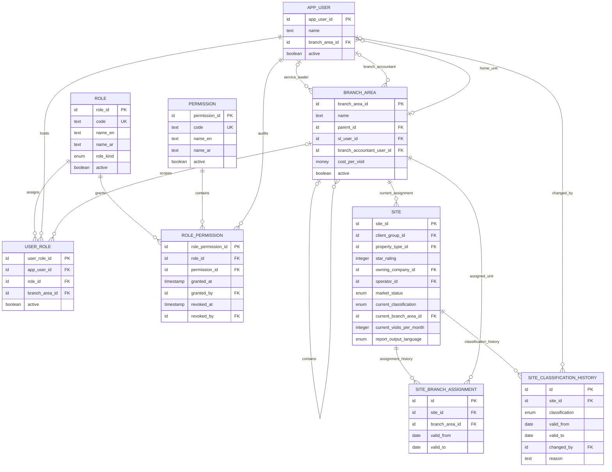

# Stage 1 ERD - Slice 1: Organisation And Client Assignment

**Status: PROPOSED FOR REVIEW - not approved for migration.**

This slice renders the minimum organisation and client-assignment structure needed for
branch-scoped access. It follows Data Model Rev 4 section 1, Stage 1 E1 sections 1 and
2, and owner rulings `RULING-2026-08-10-001` to `003`.

Fields introduced by the normalized role ruling are explicitly proposed here for ERD
review. This document is not a migration and creates no database objects.

## ERD

## Ruled Changes From Data Model Rev 4

### Greenfield

- `site.market_status` is `GREENFIELD` or `OPERATING`.
- `site.current_classification` is nullable and contains only `C`, `ANC`, `PC`, or
  `EXCLUDED`.
- `site_classification_history.classification` contains the same four values and never
  `GREENFIELD`.
- Greenfield sites have no operating classification and are excluded from TOH.
- A Greenfield-to-Operating transition writes the first classification history row and
  updates the current classification in the same transaction.

### Branches

- `branch_area` remains an OM-editable hierarchy; branch names are data, not enums.
- Canonical launch branches are Hurghada, Sharm El Sheikh, Cairo, Alexandria, North
  Coast, Marsa Alam, and Upper Egypt (Luxor/Aswan).
- `Alex + Sahel` is a roster coverage label for two separate canonical branches. A
  shared SL or Branch Accountant is represented by both units pointing to the same
  `app_user`.
- Import aliases do not create additional `branch_area` rows.

### Roles And Permissions

- The Data Model Rev 4 `app_user.role` enum is removed.
- `role` contains protected system roles and OM-configurable office roles.
- `user_role` permits more than one role per user. A nullable `branch_area_id` means a
  company-wide assignment; a value scopes the assignment to that unit.
- `permission` is the stable server-side capability catalog.
- `role_permission` is the auditable grant/revoke relationship. Default-deny applies
  when no active grant authorizes an action.
- Exact permission grants and named exceptions remain deferred to `SPEC-009`.

## Required Database Invariants

These are acceptance constraints for the later migration, not SQL in this document:

1. An operating site has exactly one current classification in `C`, `ANC`, `PC`, or
   `EXCLUDED`; a Greenfield site has none.
2. A site has at most one open classification-history row and at most one open
   branch-assignment row (`valid_to IS NULL`).
3. Closing an open history row, inserting its successor, and updating the site's
   denormalized current value occur in one transaction.
4. History rows reject deletes and reject updates other than the permitted close of the
   current open row.
5. `valid_to` is null or not earlier than `valid_from`.
6. A `branch_area` cannot be its own parent and cannot form a hierarchy cycle.
7. Active role assignments are unique for user, role, and scope; company-wide scope is
   treated as one scope for uniqueness.
8. A revoked role-permission grant is retained for audit and cannot become active again;
   a new grant creates a new record.
9. Deactivated users, roles, branches, and permissions remain available for historical
   attribution but cannot receive new operational assignments.
10. All configuration and permission changes stamp actor and UTC timestamp.

## Field Provenance

| Entity / fields | Authority |
| --- | --- |
| `app_user`: `app_user_id`, `name`, `branch_area_id`, `active` | Data Model Rev 4 section 1.1 |
| `branch_area`: all displayed fields | Data Model Rev 4 section 1.1 |
| `site`: all displayed Data Model fields | Data Model Rev 4 section 1.2 |
| `market_status` and four-value classification | `RULING-2026-08-10-001` |
| Both history entities and their displayed fields | Data Model Rev 4 section 1.2, modified only to remove `GREENFIELD` from classification |
| Normalized role entities and cardinality | `RULING-2026-08-10-003` |
| Proposed role/permission field set and grant audit shape | ERD proposal requiring review |

## Review Flags

- `SPEC-009`: the detailed access matrix is missing. This blocks permission seed data
  and final authorization contracts, not the normalized entity structure.
- `SPEC-010`: Data Model Rev 4 defines no site name, operational identifier, address, or
  active-state fields. The ERD does not invent them; the `site` entity is incomplete for
  migration until the owner issues the identity field set.
- `SPEC-011`: Data Model Rev 4 defines no login identifier, email, or identity-provider
  subject for `app_user`. The ERD does not invent an authentication identity; user-table
  migration waits for the authentication contract.
- Primary-key SQL type, money representation, enum implementation, and migration
  mechanics are technical decisions to be finalized in the accepted database-tooling
  ADR before migration.

## Review Gate

Approval of this ERD confirms only the entity boundaries, relationships, cardinalities,
and ruled field changes. Migration work starts only after:

1. `SPEC-010` and `SPEC-011` are ruled for the affected entity fields.
2. The database-tooling ADR and database Definition of Done are accepted.
3. The approved ERD revision is committed with its review record.

