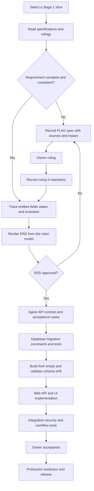

# ST Online 2.0 Preliminary Delivery Workflow

**Status: PROPOSED - to be approved during Phase 0.**

This document explains how Stage 1 work moves from an authoritative requirement to a
released feature. It is a coordination view only. It does not replace `CLAUDE.md`, the
specifications, approved owner rulings, the ERD, or an API contract.

## Roles

| Role | Responsibility |
| --- | --- |
| Owner (Kamal) | Rules on specification questions, approves scope and business behaviour, and accepts delivered outcomes. |
| Lead developer (Mohamed) | Owns the complete technical delivery: ERD, database, API, web application, tests, integration, and release preparation. Codex and Claude Code may assist, but all output remains governed by the repository contracts and approved specifications. |
| Manager | Monitors progress, risks, decisions, and delivery evidence; no technical implementation is assigned. |
| IT | Assesses production hosting, security, backup, recovery, access, and operational readiness. |

## Authority Gate

Every task starts by checking authority in this order:

1. `CLAUDE.md` Revision 4.
2. The authoritative Stage 1 specification set in `docs/specifications/`.
3. Approved owner rulings recorded in `docs/rulings/decisions.md`.
4. The approved task acceptance criteria and API contract.

If the sources are incomplete or contradictory, the affected task becomes a
`FLAG(spec)` question in `docs/rulings/open-questions.md`. Kamal rules on the question;
neither Codex nor Claude Code fills the gap by assumption.

## End-To-End Flow

## Delivery Stages

### 0. Controlled Baseline

The repository constitution and Stage 1 specifications are committed first. The team
then approves repository protection, CODEOWNERS, the ERD process, the API-contract
process, and the Definition of Done. IT supplies a written production-hosting
assessment. Phase 0 exit criteria are maintained in `docs/phase-0/plan.md`.

**Output:** a protected repository, approved working agreements, a ready toolchain,
and a named first slice with no blocking questions.

### 1. Scope And Rulings

For the selected slice, the lead developer identifies required behaviours, lifecycle
states, permissions, configuration, and audit obligations. Contradictions or missing
definitions are recorded with their exact sources, the decision needed, and the work
they block.

**Output:** approved rulings and measurable acceptance criteria. Conversation and email
alone are not implementation authority; the ruling must be recorded in the repository.

### 2. ERD And Data Contract

Mohamed renders the specification and rulings without redesigning them. For this stage
he works under the database-track rules in `AGENTS.md`, tracing every table,
relationship, lifecycle, snapshot, history rule, and critical constraint to its source.
Anything that appears wrong returns to the owner as a flag.

**Output:** an approved ERD slice and traceability record.

### 3. API Contract

The lead developer defines the request and response shapes, identifiers, validation,
errors, lifecycle commands, authorization rules, and database/application boundary
before implementing either side. Database artifacts still follow the database-track
rules in `AGENTS.md`, even though one developer owns both sides.

**Output:** a versioned API contract with success, validation, authorization, conflict,
and immutability acceptance cases.

### 4. Database Implementation

Mohamed creates immutable PostgreSQL migrations, server-enforced constraints,
configuration loaders, and focused tests. Each change must build from an empty
database, preserve append-only history and snapshots, and pass schema-drift validation.
Operational exports stay outside Git and pass through controlled profiling, mapping,
validation, rejection, and reconciliation.

**Output:** reviewed migrations and repeatable loaders that satisfy the database
Definition of Done.

### 5. Web Implementation And Integration

Mohamed then implements the API and UI against the approved contract. Access remains
server-side and default-deny. Client-facing responses must not expose internal costs,
pipeline data, internal notes, credentials, or records outside the user's branch and
role scope.

**Output:** an integrated vertical slice with automated positive and forbidden-path
tests.

### 6. Acceptance And Production Release

The team runs the full quality gate: formatting, linting, type checks, tests, migration
rebuild, drift validation, security checks, and owner acceptance scenarios. IT verifies
production hosting, TLS, secrets, backups, restore testing, monitoring, and recovery.
Release evidence and any rollback or forward-fix procedure are recorded before deploy.

**Output:** an accepted production release with an audit trail and operational handoff.

## Current Gate - 10 August 2026

The controlled baseline, privacy-safe profiling tools, private remote, CI, CODEOWNERS,
and local PostgreSQL 18 environment exist. The following items still prevent the first
schema migration:

- The completed Users, Roles & Access Questionnaire.
- Approval of the ERD process, API-contract process, and database Definition of Done.
- Review and approval of the first ERD slice.
- GitHub private-repository branch protection, which requires a plan upgrade.
- IT's written pass/fail production-hosting assessment.

The proposed first core slice is `app_user -> branch_area -> site -> assignment and
classification history`, with the normalized role/permission entities in front of
`app_user`. `SPEC-003`, `SPEC-004`, and `SPEC-005` are ruled, so the slice may enter ERD
review. It must not enter migration implementation until the ERD is approved.

## Working Rhythm

1. Select one independently deliverable vertical slice.
2. Resolve only the flags that block that slice.
3. Approve its ERD and API contract.
4. Implement database work before its dependent API and web integration.
5. Review through a pull request with required checks and ownership approval.
6. Demonstrate acceptance cases and record the session summary.
7. Merge only when the applicable Definition of Done is satisfied.

Stage 2 and v2.1 modules remain deferred until formally opened by the owner.
